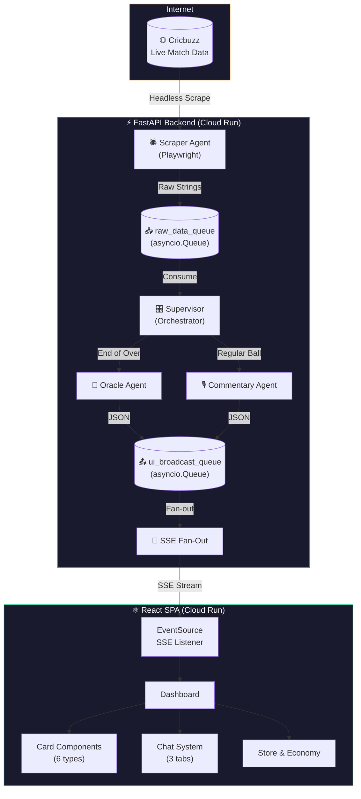
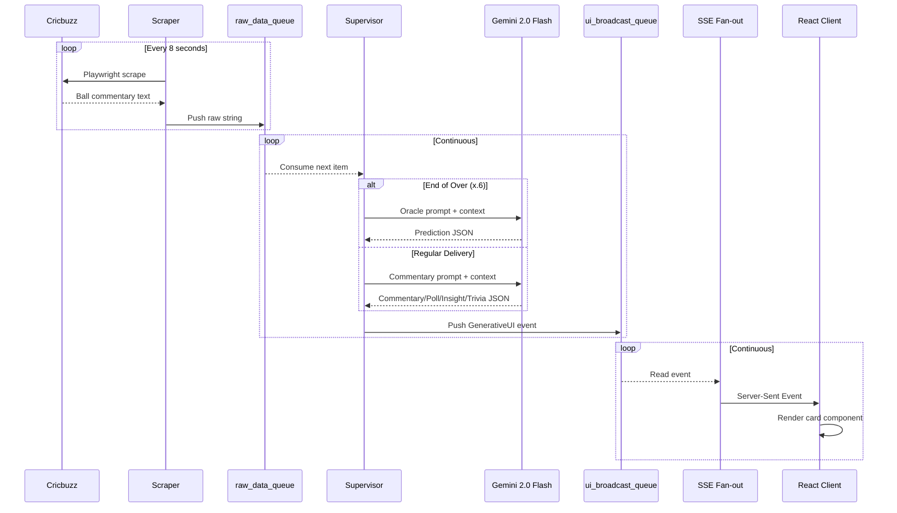
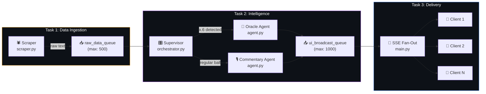
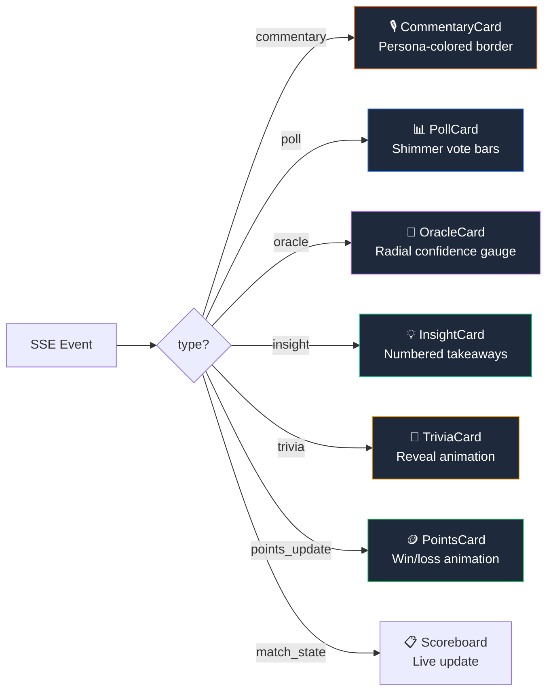
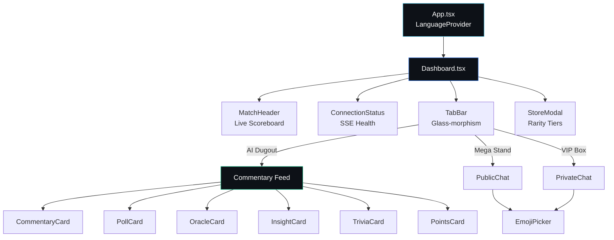
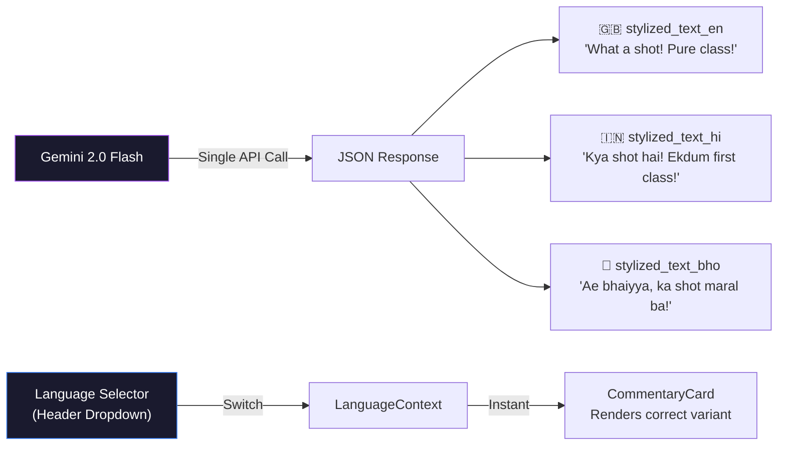
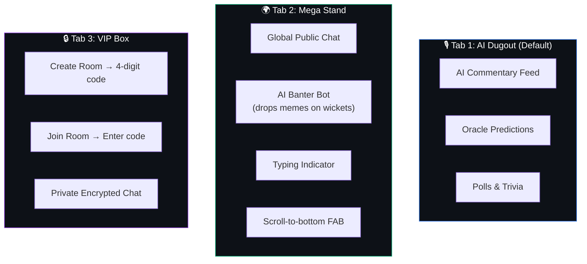
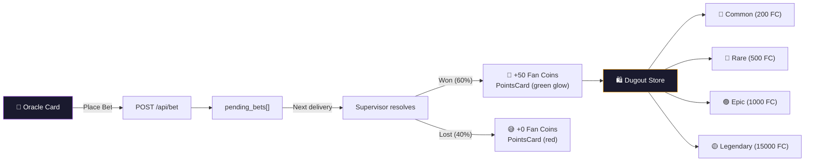

<p align="center">
  
  
  
  
</p>

<h1 align="center">🏏 Dugout.ai</h1>
<p align="center"><strong>AI-Powered Second-Screen Companion for Live Cricket</strong></p>
<p align="center">
  <em>A proactive, multi-agent system that autonomously monitors live IPL matches and pushes interactive Generative UI to your screen in real-time.</em>
</p>

---

## 📋 Table of Contents

- [What is Dugout.ai?](#-what-is-dugoutai)
- [Features at a Glance](#-features-at-a-glance)
- [System Architecture](#-system-architecture)
- [Multi-Agent Pipeline](#-multi-agent-pipeline)
- [Generative UI JSON Contract](#-generative-ui-json-contract)
- [Frontend Architecture](#-frontend-architecture)
- [Multilingual Engine](#-multilingual-engine)
- [3-Tab Social System](#-3-tab-social-system)
- [Gamification — Fan Karma Economy](#-gamification--fan-karma-economy)
- [Tech Stack](#-tech-stack)
- [Project Structure](#-project-structure)
- [Setup & Local Development](#-setup--local-development)
- [Environment Configuration](#-environment-configuration)
- [Cloud Run Deployment](#-cloud-run-deployment)
- [Design System](#-design-system)
- [API Reference](#-api-reference)
- [Mock Mode](#-mock-mode)
- [License](#-license)

---

## 🎯 What is Dugout.ai?

Dugout.ai transforms your phone or laptop into a **smart second-screen** while watching IPL cricket. Instead of passively watching, you get:

- **AI predictions** before each delivery
- **Personalized commentary** in your preferred language and persona
- **Interactive polls** and **trivia** triggered by match events
- **Real-time chat** with the global cricket community
- **Gamified betting** with Fan Coins you earn by predicting correctly

The entire system is **autonomous** — AI agents watch the match, detect events, and push interactive cards to your screen without you asking.

---

## ✨ Features at a Glance

| Feature | Description | AI Agent |
|---------|-------------|----------|
| 🔮 **Next Ball Oracle** | Predicts the next delivery with animated confidence gauge | Oracle Agent |
| 🎙️ **AI Commentator** | 3 personas × 3 languages = 9 commentary flavors | Commentary Agent |
| 📊 **Live Polls** | Interactive audience polls triggered by match events | Commentary Agent |
| 💡 **Tactical Insights** | Deep match analysis with numbered takeaways | Commentary Agent |
| 🧠 **Cricket Trivia** | Fun facts with reveal-answer animation | Commentary Agent |
| 🪙 **Fan Karma Economy** | Bet Fan Coins on predictions, earn rewards | Bet Resolution |
| 🛍️ **Dugout Store** | Redeem coins for items with rarity tiers | Client-Side |
| 💬 **Mega Stand** | Global public chat with AI Banter Bot | Banter Agent |
| 🔒 **VIP Box** | Private rooms with 4-digit codes | Supabase Realtime |
| 🌐 **Multilingual** | English, Hindi, Bhojpuri — instant switching | Gemini Native |

---

## 🏗 System Architecture

### High-Level Overview



### Data Flow (Sequence)



---

## 🤖 Multi-Agent Pipeline

The backend is an **event-driven multi-agent system** powered by `asyncio.Queue`:



### Agent Details

| Agent | File | Input | Output | Trigger |
|-------|------|-------|--------|---------|
| **Scraper** | `scraper.py` | Cricbuzz HTML | Raw ball-by-ball text | Timer (8s interval) |
| **Supervisor** | `orchestrator.py` | Raw text from queue | Routes to sub-agents | Queue consumer |
| **Oracle** | `agent.py` | Over context | Prediction + confidence % | End-of-over (x.6) |
| **Commentary** | `agent.py` | Ball context | Poll / Insight / Trivia / Commentary | Every delivery |
| **Banter Bot** | `PublicChat.tsx` | Match events | Funny AI messages in chat | Timer (25-35s) |

### Supervisor Routing Logic

```python
# orchestrator.py — simplified
async def supervisor():
    while True:
        raw_text = await raw_data_queue.get()      # Block until data
        await _resolve_pending_bets()               # Resolve any fan bets
        ctx = extract_match_context(raw_text)       # Parse score/overs
        if ctx:
            await _broadcast_match_state(ctx)       # Update scoreboard

        if _is_end_of_over(raw_text):               # "x.6" pattern
            event = await generate_oracle_prediction(raw_text)
        else:
            event = await generate_realistic_commentary(raw_text)

        await ui_broadcast_queue.put(event)         # Push to clients
```

---

## 📦 Generative UI JSON Contract

Gemini outputs **strictly structured JSON** matching this schema:

```json
{
  "type": "commentary | poll | insight | oracle | trivia",
  "id": "uuid-v4",
  "timestamp": "2024-05-26T20:30:00.000Z",
  "title": "Human-readable title",
  "content": {
    "question": "Poll/insight/trivia question text",
    "options": ["Option A", "Option B", "Option C"],
    "explanation": "Detailed explanation",
    "prediction": "Oracle's specific prediction",
    "probability": 85,
    "stylized_text_en": "English commentary",
    "stylized_text_hi": "Hindi commentary",
    "stylized_text_bho": "Bhojpuri commentary",
    "persona": "Gen-Z Meme Lord",
    "fun_fact": "Trivia answer text"
  }
}
```

### Event Types → Card Components



---

## ⚛️ Frontend Architecture

### Component Tree



### State Management

| State | Location | Mechanism |
|-------|----------|-----------|
| SSE Events | `useLiveMatch` hook | `EventSource` API + reconnection |
| Match Score | `useLiveMatch` hook | Extracted from `match_state` events |
| Fan Coins | `useLiveMatch` hook | Incremented on bet resolution |
| Language | `LanguageContext` | React Context + `localStorage` |
| Chat Messages | Component state | Local + Supabase Realtime |
| Store Modal | Component state | `useState` boolean |

---

## 🌐 Multilingual Engine

All commentary is generated natively in **3 languages simultaneously** per Gemini call:



> **Zero-latency switching**: All 3 variants are bundled in one SSE payload. The frontend resolves the active language client-side — no re-fetches needed.

---

## 💬 3-Tab Social System



---

## 🪙 Gamification — Fan Karma Economy



---

## 🛠 Tech Stack

| Layer | Technology | Purpose |
|-------|-----------|---------|
| **Frontend** | React 19 + Vite + TypeScript | SPA client (no SSR) |
| **Styling** | Tailwind CSS 3 + Custom CSS | Design system with glow/glass utilities |
| **Animations** | Framer Motion | Card transitions, tab pills, gauges |
| **Icons** | Lucide React | Consistent icon library |
| **Backend** | FastAPI + Uvicorn | Async Python API server |
| **AI Engine** | Gemini 2.0 Flash (google-genai SDK) | Structured JSON generation |
| **Scraper** | Playwright (async headless) | Live cricket data ingestion |
| **Realtime** | SSE (Server-Sent Events) | Backend → Frontend streaming |
| **Chat DB** | Supabase (optional) | Multiplayer chat persistence |
| **Deployment** | Google Cloud Run (Docker) | Containerized microservices |

---

## 📁 Project Structure

```
Agentic_premier_league/
├── backend/
│   ├── main.py              # FastAPI app, SSE endpoint, lifespan tasks
│   ├── orchestrator.py      # Supervisor — routes events to agents
│   ├── agent.py             # Gemini agent functions + mock fallbacks
│   ├── scraper.py           # Playwright scraper + built-in dataset
│   ├── queues.py            # asyncio.Queue event bus (raw + UI)
│   ├── requirements.txt     # Python deps
│   ├── Dockerfile           # Cloud Run container
│   └── .env.example         # Environment template
│
├── frontend/
│   ├── src/
│   │   ├── components/
│   │   │   ├── Dashboard.tsx       # Main layout + feed
│   │   │   ├── MatchHeader.tsx     # Live scoreboard (team badges, RR)
│   │   │   ├── TabBar.tsx          # Glass-morphism 3-tab nav
│   │   │   ├── CommentaryCard.tsx  # Persona-colored AI commentary
│   │   │   ├── PollCard.tsx        # Interactive polls + shimmer bars
│   │   │   ├── OracleCard.tsx      # SVG confidence gauge + bet UI
│   │   │   ├── InsightCard.tsx     # Stat callouts + takeaways
│   │   │   ├── TriviaCard.tsx      # Reveal-answer accordion
│   │   │   ├── PointsCard.tsx      # Win/loss coin animation
│   │   │   ├── PublicChat.tsx      # Mega Stand + Banter Bot
│   │   │   ├── PrivateChat.tsx     # VIP Box (create/join rooms)
│   │   │   ├── StoreModal.tsx      # Rarity-tiered reward store
│   │   │   ├── LanguageSelector.tsx# 3-lang dropdown
│   │   │   ├── EmojiPicker.tsx     # Chat emoji grid
│   │   │   ├── ConnectionStatus.tsx# SSE health indicator
│   │   │   ├── ErrorBoundary.tsx   # Graceful crash recovery
│   │   │   └── Toast.tsx           # Global notifications
│   │   ├── hooks/
│   │   │   └── useLiveMatch.ts     # SSE hook + auto-reconnect
│   │   ├── context/
│   │   │   └── LanguageContext.tsx  # Global language state
│   │   ├── lib/
│   │   │   └── supabase.ts         # Chat client + demo users
│   │   ├── App.tsx                 # Root with LanguageProvider
│   │   ├── App.css                 # Design system (glow, glass, shimmer)
│   │   └── main.tsx                # Entry point
│   ├── tailwind.config.js          # Extended palette + animations
│   ├── index.html                  # SEO + Google Fonts (Inter + Outfit)
│   ├── Dockerfile                  # Multi-stage nginx build
│   └── package.json
│
├── docker-compose.yml      # One-command full-stack launch
├── start.bat               # Windows dev launcher
└── README.md
```

---

## 🚀 Setup & Local Development

### Prerequisites

- **Python 3.11+** (with pip)
- **Node.js 20+** (with npm)
- *Optional:* Google AI Studio API key for live Gemini responses

### Quick Start (Windows)

```bash
# Double-click or run:
start.bat
```
This opens two terminals — backend on `:8000` and frontend on `:5173`.

### Quick Start (Docker Compose)

```bash
docker-compose up --build
# Frontend: http://localhost:3000
# Backend:  http://localhost:8080
```

### Manual Setup

**Terminal 1 — Backend:**
```bash
cd backend
python -m venv venv
venv\Scripts\activate          # Windows
# source venv/bin/activate     # Mac/Linux
pip install -r requirements.txt
playwright install chromium
uvicorn main:app --host 0.0.0.0 --port 8000
```

**Terminal 2 — Frontend:**
```bash
cd frontend
npm install
npm run dev
# → http://localhost:5173
```

---

## ⚙️ Environment Configuration

### Backend (`backend/.env`)

| Variable | Description | Default |
|----------|-------------|---------|
| `GEMINI_API_KEY` | Google AI Studio key ([get one](https://aistudio.google.com/apikey)) | *(mock mode)* |
| `GCP_PROJECT_ID` | Vertex AI project (alternative to API key) | *(blank)* |
| `GCP_LOCATION` | Vertex AI region | `us-central1` |
| `GEMINI_MODEL` | Model name | `gemini-2.0-flash` |
| `MATCH_URL` | Cricbuzz match URL | KKR vs SRH Final |
| `SCRAPE_INTERVAL` | Seconds between balls | `8` |
| `LOOP_SIMULATION` | Loop dataset forever | `true` |
| `USE_BUILTIN_DATA` | `true` / `false` / `auto` | `auto` |

### Frontend (`frontend/.env`)

| Variable | Description | Default |
|----------|-------------|---------|
| `VITE_API_URL` | Backend URL | `http://localhost:8000` |
| `VITE_SUPABASE_URL` | Supabase project URL | *(demo mode)* |
| `VITE_SUPABASE_ANON_KEY` | Supabase anon key | *(demo mode)* |

### Gemini Init Priority

```
1. GEMINI_API_KEY set? → Google AI Studio mode
2. GCP_PROJECT_ID set? → Vertex AI mode
3. Neither? → MOCK mode (sample data, no API calls)
```

---

## ☁️ Cloud Run Deployment

Both services have `Dockerfile`s configured for Cloud Run's dynamic `$PORT`:

```bash
# Backend
gcloud builds submit ./backend --tag gcr.io/PROJECT_ID/dugout-backend
gcloud run deploy dugout-backend \
  --image gcr.io/PROJECT_ID/dugout-backend \
  --set-env-vars GEMINI_API_KEY=your-key \
  --allow-unauthenticated

# Frontend (inject backend URL)
gcloud builds submit ./frontend --tag gcr.io/PROJECT_ID/dugout-frontend \
  --build-arg VITE_API_URL=https://dugout-backend-xxxxx.run.app
gcloud run deploy dugout-frontend \
  --image gcr.io/PROJECT_ID/dugout-frontend \
  --allow-unauthenticated
```

---

## 🎨 Design System

The UI uses a **premium dark-mode SaaS aesthetic** with semantic color tokens:

| Token | Color | Usage |
|-------|-------|-------|
| `dark-950` → `dark-600` | 7-shade dark | Background depth layers |
| `primary-400` → `primary-700` | Blue | Buttons, links, poll bars |
| `oracle-400` → `oracle-600` | Purple | Oracle cards, VIP chat |
| `trivia-400` → `trivia-600` | Amber/Gold | Trivia cards, legendary items |
| `accent-400` → `accent-600` | Emerald | Insight cards, positive states |

### CSS Utilities

| Class | Effect |
|-------|--------|
| `.glass` | Backdrop-blur glass-morphism |
| `.glow-primary` `.glow-oracle` `.glow-trivia` | Box-shadow glows |
| `.shimmer-bg` | Animated shimmer (vote bars) |
| `.pulse-dot` | CSS pulsing indicator (batting team) |
| `.card-hover` | Lift-on-hover with shadow |
| `.typing-dot` | Chat typing bounce animation |
| `.waveform-bar` | Empty-state animated bars |
| `.text-gradient-*` | Gradient text effects |

### Typography

- **Display**: `Outfit` — headings, card titles, scores
- **Body**: `Inter` — paragraphs, labels, metadata

---

## 📡 API Reference

| Endpoint | Method | Description |
|----------|--------|-------------|
| `/api/stream` | `GET` (SSE) | Real-time GenerativeUI event stream |
| `/api/bet` | `POST` | Place a Fan Coin bet `{user_id, bet}` |
| `/api/match-state` | `GET` | Current scoreboard state (REST fallback) |
| `/api/health` | `GET` | Health check for Cloud Run |
| `/` | `GET` | Diagnostics (agent status, client count) |

---

## 🛡 Mock Mode

If no Gemini credentials are configured, the backend runs in **Mock Mode**:

- Uses realistic pre-built commentary data from the IPL 2024 Final
- Generates all event types (commentary, polls, insights, oracle, trivia)
- Supports all 3 languages in mock responses
- **Perfect for demos and local development**

The system also has **rate-limit resilience** — if Gemini returns 429, it automatically falls back to mock responses for a cooldown period.

---

## 🏆 Built For

**Google Cloud Hackathon** — Demonstrating:
- Multi-agent AI orchestration with Gemini 2.0 Flash
- Event-driven architecture with asyncio
- Generative UI pushed via SSE
- Production-grade frontend with premium UX
- Cloud Run deployment readiness

---

<p align="center">
  <strong>Made with 🏏 and ☕ for the love of cricket and AI</strong>
</p>
